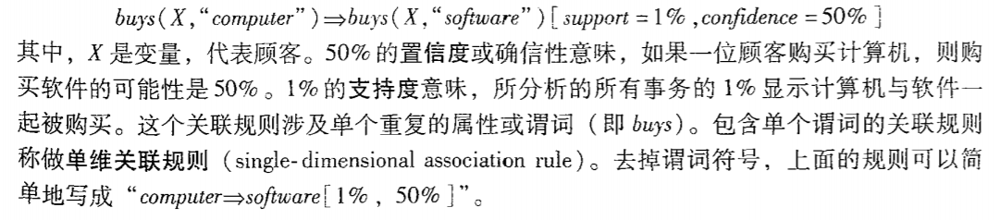
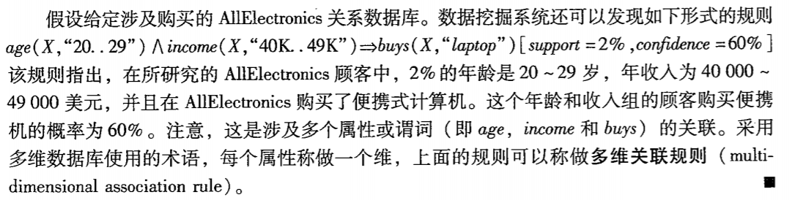
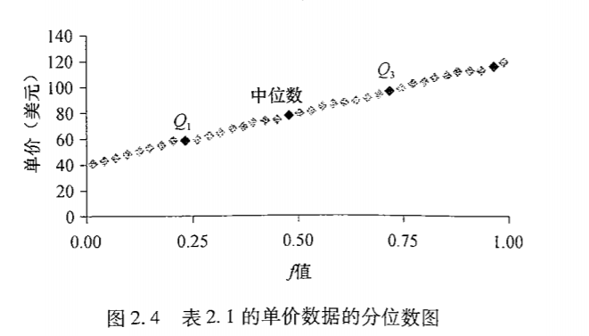
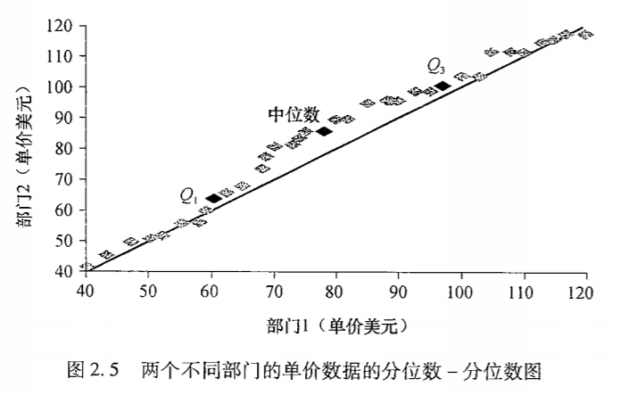

## 挖掘模式
1. 数据特征化和数据区分
    * 数据特征化：目标类数据的一般特性或特征的汇总（描述性统计）
    * 数据区分：多类数据特征的对比
2. 频繁模式、关联和相关性
    * 频繁项集：指频繁地在事务数据集中一起出现的商品的集合。
    
    * 关联分析：(X=>Y)[support= , confidence= ]
        * 支持度：support(X=>Y) = P(X and Y)
        * 置信度：confidence(X=>Y) = P(Y|X)
        1. 单维关联规则：涉及单个重复的属性或谓词
        
        2. 多维关联规则：
        
3. 分类和回归
4. 聚类
5. 离群点分析
        
## 数据

1. 数据属性类型
    * 离散型
        * 标称属性
        * 二元属性
        * 序数属性
     
    * 连续性
        * 区间标度属性：没有绝对零点。如时间和摄氏温度，不能用倍数
        * 比率标度属性：有绝对零点。可以用倍数
2. 数据的基本统计描述
    * 中心趋势度量：均值、中位数和众数
    * 度量数据散布：极差、四分位、方差、标准差和四分位极差
        * 四分位极差：IQR = Q3-Q1
        * 方差和标准差
        > (1-1/k*k) * 100%个数离均值的距离不超过k个标准差
3. 数据的基本统计描述的图形显示
    * 分位数图
    
    * 分位数-分位数图（q-q图）
    
    * 直方图
    * 散点图
## 数据可视化
1. 基于像素（一维）

2. 几何投影（多维）散点图

3. 基于图符

    
    
        

