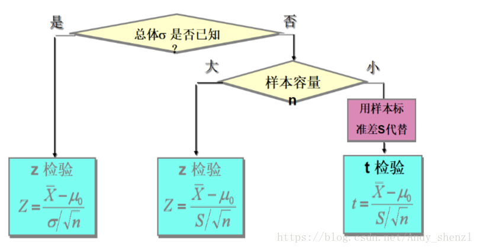

####[假设检验](https://blog.csdn.net/andy_shenzl/article/details/81453509)
* 利用小概率思想，即认为小概率事件在一次试验中基本上不可能发生，然后在假设的基础上如果这个小概率事件发生了，就拒绝原假设。  
* 检验统计量的选择

####[方差分析](https://baike.baidu.com/item/%E6%96%B9%E5%B7%AE%E5%88%86%E6%9E%90/1502206?fr=aladdin)
##### 单因素方差分析
* 方差分析的基本思想是：通过分析研究不同来源的变异(组间方差）对总变异（组间方差和组内方差）的贡献大小，从而确定可控因素对研究结果影响力的大小。  
* 控制变量不同水平下观测变量总体方差无显著差异是方差分析的前提要求，如果没有满足这个前提要求，就不能认为各总体分布相同。因此，有必要对【方差是否齐性】进行检验。（原假设的基础）  
*  
##### 多因素方差分析
